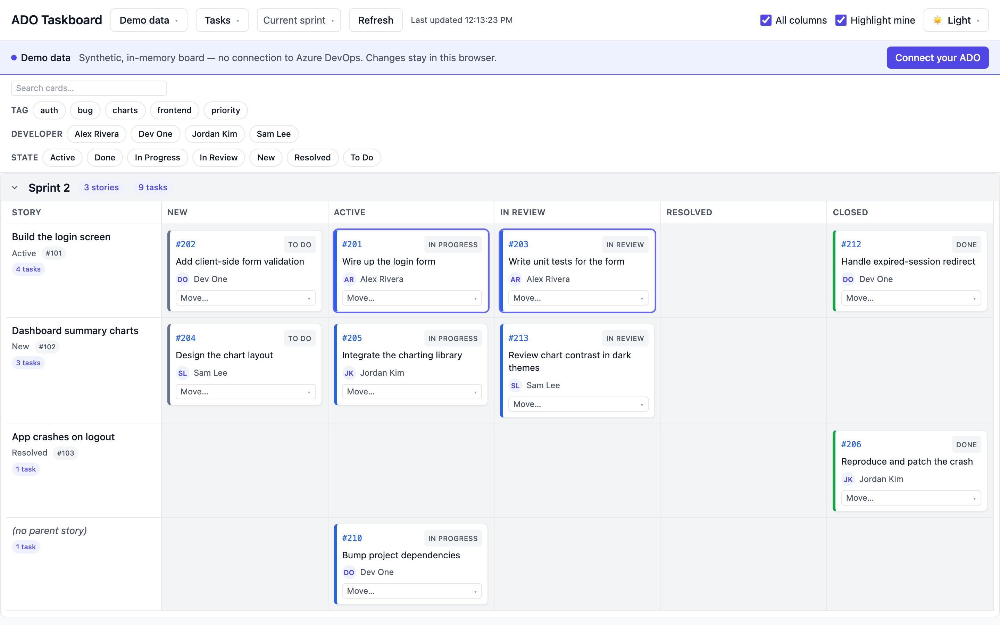
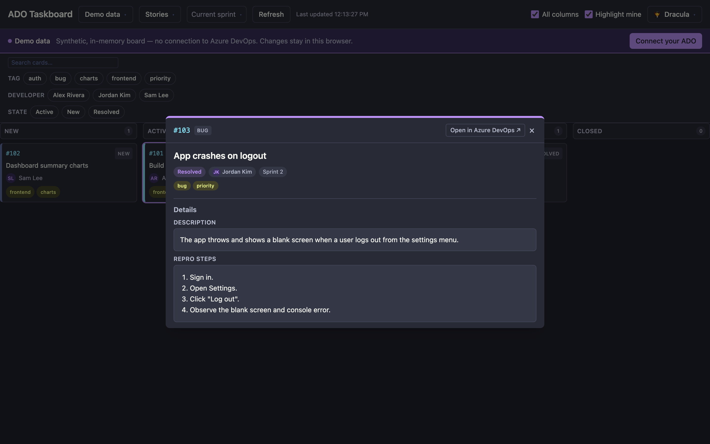
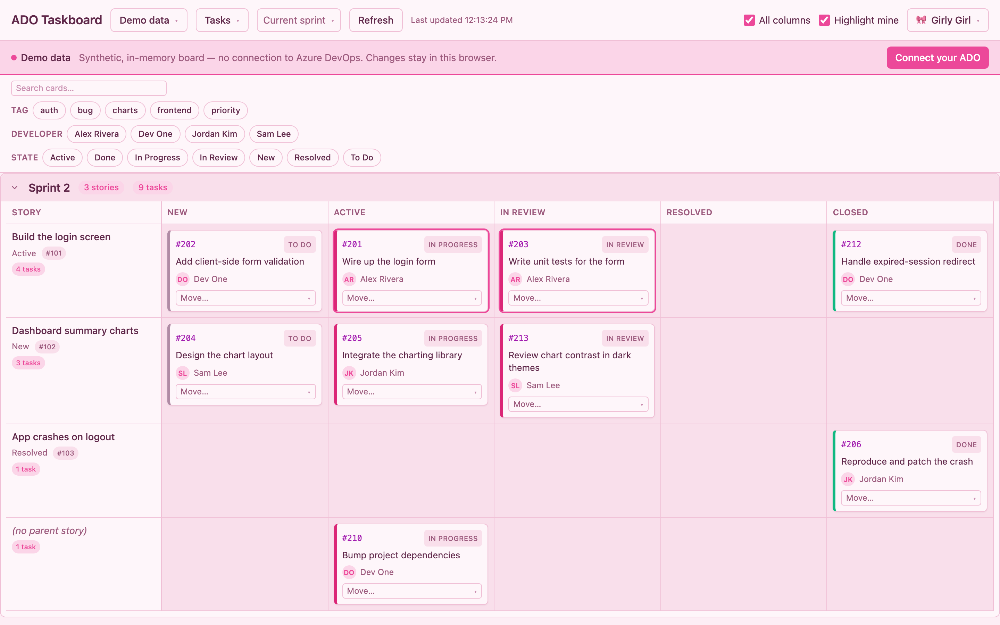
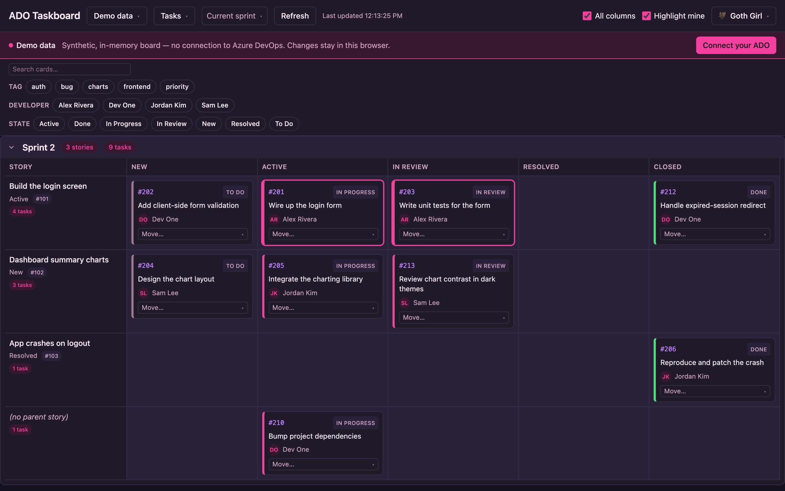
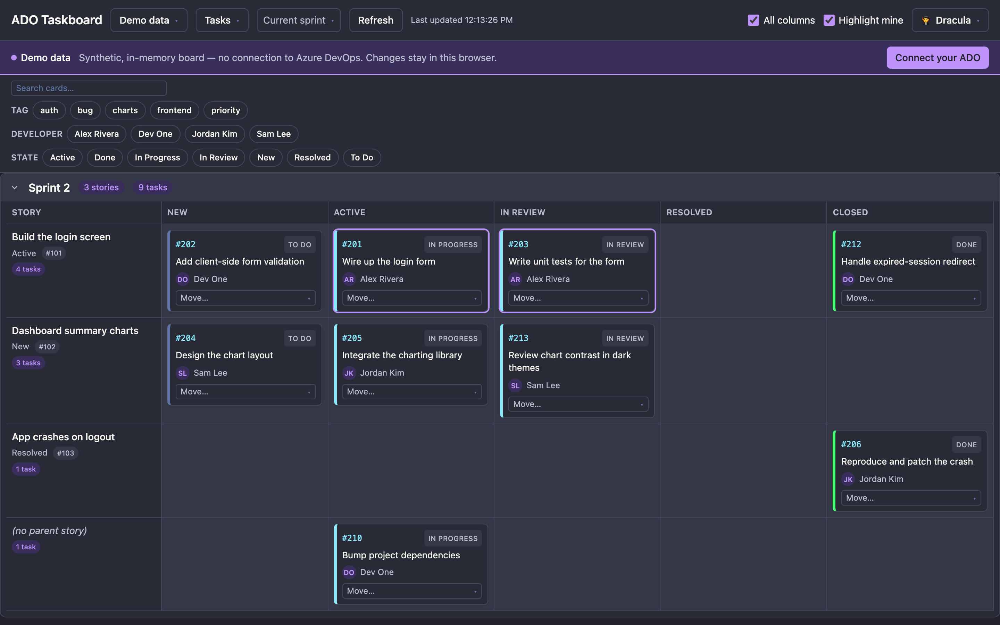

# ado-taskboard

A local, live board for **Azure DevOps**. It renders any ADO team board as a
**story-per-row** grid — user stories pinned in a fixed left column, their child
tasks laid out in board-state columns to the right — and lets you **drag a card
to move it**, writing the new state straight back to ADO.

Point it at any org / project / team from an in-app login screen, and switch
between multiple connections without restarting.

## Screenshots

Run `npm run dev` and — with nothing configured — it opens on a built-in **demo
board** (synthetic data, no network), which is what's shown here.



The ticket modal renders each work-item type's real fields — here a Bug's
description and repro steps:



21 built-in light & dark themes — a few:

| Girly Girl | Goth Girl | Dracula |
|---|---|---|
|  |  |  |

## Requirements

- Node.js 20+ and npm.
- An Azure DevOps Personal Access Token with **Work Items (Read & Write)** —
  read-only works too, drag-and-drop just won't persist.

## Setup

```bash
npm install
npm run dev
```

Open the printed local URL. On first load you'll see a **login screen** — enter
your ADO organization, project, and a PAT. The connection is validated against
ADO before it's saved, then kept in your browser. Add more connections and
switch between them from the **Connection** dropdown in the header; "Log out"
clears one or all of them.

Team-admin permissions are **not** required — iterations come from the project's
classification nodes rather than the team's sprint subscription, so every
project sprint shows up even if the team was never configured to see it.

### Optional: `.env` for a zero-login start

```bash
cp .env.example .env   # fill in ADO_ORG / ADO_PROJECT / ADO_PAT (see the file)
```

Not required. If present, the app auto-seeds a default connection on first run
and goes straight to the board with no login step. Handy for a personal
quick-start or for hosting a shared instance.

## Running the built app

The `/api/ado` proxy the dev server provides also ships in a tiny standalone
production server (`server/index.mjs`) that serves the built `dist/` and
forwards `/api/ado/*` to ADO:

```bash
npm run serve      # build, then start the server
# or, if dist/ is already built:
npm run start
```

Open `http://localhost:5280` (or `$PORT`).

## Docker

```bash
docker compose up --build
```

`.env` is optional and read at container start (via `env_file`) — set it to
auto-seed a connection for every visitor, or leave it out and let each visitor
add their own from the login screen. Open `http://localhost:5280`.

## Features

- **Any board, discovered.** Work-item types, board columns, states, backlog
  levels, and iterations are all read from ADO at runtime — nothing
  project-specific is hardcoded.
- **Level toggle.** Switch between the lane-grouped **Tasks** view and flat
  **Stories** / portfolio (Features, Epics, …) views, discovered per project.
- **Iteration picker.** Current sprint / all sprints / a specific sprint
  (searchable). "Current" is detected by date, not ADO's team timeframe.
- **Drag-and-drop moves.** Dropping a card updates the UI optimistically,
  PATCHes the new state to ADO, and rolls back with a toast on failure. Moves
  serialize; a same-state drop is a no-op. A per-card **Move…** menu does the
  same without dragging.
- **Ticket modal.** Opens a work item with the real fields for its type (a
  Bug's repro steps, a Story's description + acceptance criteria, …), plus its
  links.
- **Filters.** Searchable multi-select by developer / tag / state, client-side.
- **Sprint sections.** Collapsible, newest first, with per-lane and per-sprint
  counts, a sticky header row, and a sticky story column.
- **Themes.** 21 light & dark palettes with a grouped picker; your choice
  persists across reloads.
- **Refresh** on demand, with a "last updated" stamp.

## Scope / limits

- **Moves only.** The only write is a work item's state/column — no title,
  description, tag, or assignee edits.
- **Local.** Runs on your machine; there's no hosted instance.
- Some task states don't map 1:1 to a distinct board column and collapse onto
  the first in-progress column — a documented limitation, see
  `docs/task-column-mapping.md`.

## Quality gate

Local git hooks (Husky), installed automatically on `npm install`:

- **pre-commit** → `lint-staged`: `oxlint` on staged files + a project-wide
  typecheck.
- **pre-push** → the full fast gate: `npm run typecheck && npm run lint && npm test`.

End-to-end tests run separately (fully mocked — no token, no live ADO):

```bash
npm run test:e2e     # Playwright
```

The e2e suite intercepts every `/api/ado/**` call in-page and serves committed
JSON fixtures, so the smoke specs (board loads, ticket modal, search, iteration
switch) are deterministic and self-contained.

## Architecture

- **Connections** (`src/connections/`) — org/project/token are runtime, not
  build-time: a connection lives in `localStorage`, one or more per browser, one
  active. The client (`src/api/client.ts`) sends the active connection's
  org/token as headers on every `/api/ado` call; the browser never calls
  `dev.azure.com` directly.
- **Proxy** (`vite.config.ts` dev / `server/index.mjs` prod) — relays the
  connection's org/token per request, or falls back to `.env` when a connection
  leaves them blank. This is the one place the `Authorization` header is
  attached.
- **Pure domain** (`src/domain/`) — transforms raw ADO work items into sprint
  sections → lanes → columns, independent of any UI or fetching. Drag-and-drop
  runs through a pure `performMove` / `moveCard` reducer that computes the
  optimistic next state; the board persists it with a serialized PATCH and rolls
  back on failure.

See `CLAUDE.md` for the architecture invariants and `docs/PRINCIPLES.md` for the
governing "discover everything from ADO" rule.

## Roadmap

Tracked as GitHub issues and the project board. The governing design rule —
everything discovered from ADO at runtime, nothing project-specific hardcoded —
lives in `docs/PRINCIPLES.md`.
